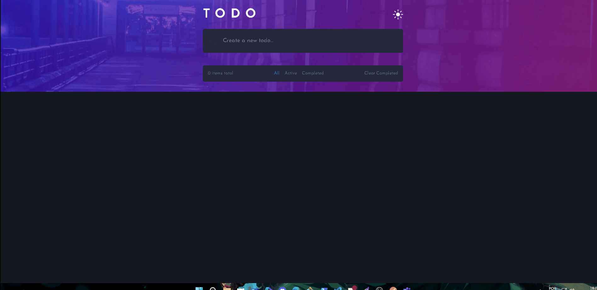

# 📝 TodoList – React + TypeScript + Tailwind CSS

Este projeto é uma aplicação **TodoList** desenvolvida com **React**, **TypeScript** e **Tailwind CSS**, criada com o objetivo de reforçar conceitos fundamentais de **React** como _componentização_, _Context API_, _hooks customizados_ e o uso de **Tailwind** para estilização.

## 🖼️ Preview do Projeto


---


## 🚀 Tecnologias Utilizadas

- **React + Vite** — Estrutura do projeto, componentização e reatividade.  
- **TypeScript** — Tipagem estática e segurança no desenvolvimento.  
- **Tailwind CSS** — Estilização utilitária, responsiva e produtiva.  
- **Context API** — Gerenciamento global de tema (Dark/Light).  
- **Hooks customizados** — Lógica de gerenciamento da lista de tarefas.

---

## 📂 Estrutura do Projeto

```bash
src
 ├── assets/
 ├── components/
 │   ├── TodoContainer/
 │   ├── TodoForm/
 │   ├── TodoHeader/
 │   └── TodoList/
 ├── contexts/
 │   ├── theme.ts
 │   ├── ThemeContext.ts
 │   └── ThemeProvider.tsx
 ├── hooks/
 │   └── useTodo.ts
 ├── styles/
 │   └── globals.css
 ├── App.tsx
 └── main.tsx

````

## ⚙️ Funcionalidades

- ✅ **Adicionar Tarefas** – Insira novas tarefas no campo de input.
- ✅ **Marcar como Concluída** – Clique no círculo ao lado da tarefa para marcar/desmarcar.
- ✅ **Filtrar Tarefas** – Filtre entre `All`, `Active` e `Completed`.
- ✅ **Remover Tarefas** – Exclua tarefas individualmente.
- ✅ **Limpar Concluídas** – Remova todas as tarefas concluídas de uma vez.
- ✅ **Tema Claro/Escuro** – Alterne entre os temas utilizando o botão no cabeçalho.
- ✅ **Responsivo** – Layout adaptável para desktop e mobile.

---

## 🎨 Estilização

O projeto utiliza **Tailwind CSS** com um arquivo `globals.css` contendo:

- **Fonts:** `Josefin Sans` carregada localmente.
- **Variáveis de tema:** cores, gradientes e tipografia.
- **Customizações:** classes para background de tema (light/dark) e responsividade.

---

## 🧩 Componentes Principais

- **`TodoContainer`** → Estrutura principal da aplicação, aplica o tema.
- **`TodoHeader`** → Cabeçalho com título e botão de alternância de tema.
- **`TodoForm`** → Formulário para adicionar novas tarefas.
- **`TodoList`** → Renderiza a lista de tarefas, com botões de interação e filtros.

---

## 🧠 Hook Customizado – `useTodo`

Gerencia toda a lógica da aplicação:

- **`addTodo`** → Adiciona uma nova tarefa.
- **`toggleTodoCompleted`** → Marca/desmarca como concluída.
- **`filteredTodos`** → Filtra tarefas de acordo com o estado atual.
- **`clearCompleted`** → Remove todas as concluídas.
- **`removeTodo`** → Exclui uma tarefa específica.
- **`filter` e `setFilter`** → Controla o estado do filtro.

---

## Clone o repositório
````
git clone https://github.com/seu-usuario/todolist-react-ts-tailwind.git
````
## Acesse a pasta do projeto
````
cd todolist-react-ts-tailwind
````
## Instale as dependências
````
npm install
````
## Rode o projeto
````
npm run dev
````

## 🎯 Objetivo do Projeto

Este projeto foi criado com foco em aprendizado prático de:

**React com TypeScript**

**Gerenciamento de estado** com Context API e Hooks

**Estilização moderna** com Tailwind CSS

**Boas práticas** de componentização e clean code

## 📄 Licença

Este projeto é de uso livre para fins de estudo.
Sinta-se à vontade para contribuir ou sugerir melhorias!

## 💬 Contato

* **LinkedIn:** [Cassio Leite](https://www.linkedin.com/in/cassio-leite/)
* **Email:** cassiocarmo77@gmail.com


Ficarei feliz em conectar e discutir oportunidades!

---

**Cássio Leite** - Desenvolvedor Frontend